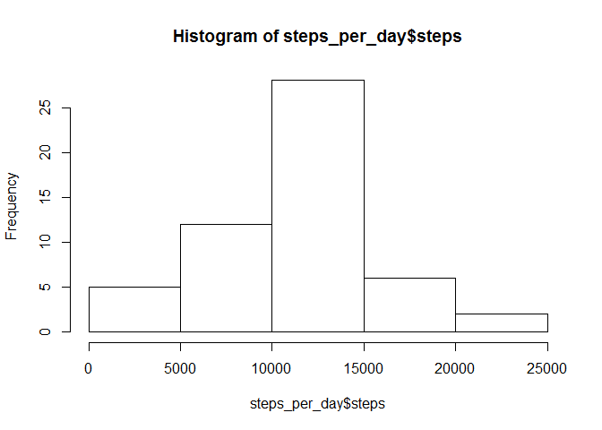

## Loading and preprocessing the data

Load "dplyr" and "ggplot2" packages.


```r
library(ggplot2)
library(dplyr)
```

Unzip the folder and load the data.


```r
unzip("activity.zip")
activity<-read.csv("activity.csv")
```

Convert date data from string to date format.

```r
activity$date <- as.Date(activity$date, format = "%Y-%m-%d")
head(activity)
```

```
##   steps       date interval
## 1    NA 2012-10-01        0
## 2    NA 2012-10-01        5
## 3    NA 2012-10-01       10
## 4    NA 2012-10-01       15
## 5    NA 2012-10-01       20
## 6    NA 2012-10-01       25
```

```r
str(activity)
```

```
## 'data.frame':	17568 obs. of  3 variables:
##  $ steps   : int  NA NA NA NA NA NA NA NA NA NA ...
##  $ date    : Date, format: "2012-10-01" "2012-10-01" ...
##  $ interval: int  0 5 10 15 20 25 30 35 40 45 ...
```

```r
summary(activity)
```

```
##      steps             date               interval     
##  Min.   :  0.00   Min.   :2012-10-01   Min.   :   0.0  
##  1st Qu.:  0.00   1st Qu.:2012-10-16   1st Qu.: 588.8  
##  Median :  0.00   Median :2012-10-31   Median :1177.5  
##  Mean   : 37.38   Mean   :2012-10-31   Mean   :1177.5  
##  3rd Qu.: 12.00   3rd Qu.:2012-11-15   3rd Qu.:1766.2  
##  Max.   :806.00   Max.   :2012-11-30   Max.   :2355.0  
##  NA's   :2304
```


## What is the mean total number of steps taken per day?

Create a variable that contains the mean steps value per day.

```r
steps_per_day <- activity %>% group_by(date) %>% summarise(steps=sum(steps))
```

Plot a histogram to show the frequency of amount of steps per day.

```r
hist(steps_per_day$steps)
```

<!-- -->

Calculate and report the mean and median total number of steps taken per day.

```r
mean_steps_per_day <- mean(steps_per_day$steps, na.rm= TRUE); mean_steps_per_day
```

```
## [1] 10766.19
```

```r
median_steps_per_day <- median(steps_per_day$steps, na.rm= TRUE); median_steps_per_day
```

```
## [1] 10765
```


## What is the average daily activity pattern?

Create a variable that contains the mean steps for all 5-minute inverval.

```r
mean_steps_per_interval <- activity %>% group_by(interval) %>% summarise(steps = mean(steps,  na.rm= TRUE))
```

Create a time series plot of the 5-minute interval (x-axis) and the average number of steps taken, averaged across all days (y-axis).

```r
plot(mean_steps_per_interval$interval, mean_steps_per_interval$steps, type="l", main= "Daily activity pattern", xlab = "Interval", ylab = "Steps")
```

<!-- -->

Which 5-minute interval, on average across all the days in the dataset, contains the maximum number of steps?

```r
max_interval <- mean_steps_per_interval[which.max(mean_steps_per_interval$steps), ]$interval; max_interval
```

```
## [1] 835
```

## Imputing missing values

Calculate and report the total number of missing values in the dataset.

```r
missing_values <- sum(is.na(activity)); missing_values
```

```
## [1] 2304
```

Create new dataframe "activity_imputed" filling in all of the missing values in the dataset with the mean for that 5-minute interval.

```r
activity_imputed <- activity 
activity_imputed$steps <- ifelse(is.na(activity$steps), mean_steps_per_interval[match(activity$interval, mean_steps_per_interval$interval),]$steps, activity$steps)
summary(activity_imputed)
```

```
##      steps             date               interval     
##  Min.   :  0.00   Min.   :2012-10-01   Min.   :   0.0  
##  1st Qu.:  0.00   1st Qu.:2012-10-16   1st Qu.: 588.8  
##  Median :  0.00   Median :2012-10-31   Median :1177.5  
##  Mean   : 37.38   Mean   :2012-10-31   Mean   :1177.5  
##  3rd Qu.: 27.00   3rd Qu.:2012-11-15   3rd Qu.:1766.2  
##  Max.   :806.00   Max.   :2012-11-30   Max.   :2355.0
```

Plot a histogram to show the frequency of amount of steps per day for the dataframe containing no missing values.

```r
steps_per_day_imputed <- activity_imputed %>% group_by(date) %>% summarise(steps=sum(steps))
hist(steps_per_day_imputed$steps)
```

<!-- -->

Calculate the mean and median steps per day for the imputed dataframe.

```r
mean_steps_per_day_imputed <- mean(steps_per_day_imputed$steps, na.rm= TRUE); mean_steps_per_day_imputed
```

```
## [1] 10766.19
```

```r
median_steps_per_day_imputed <- median(steps_per_day_imputed$steps, na.rm= TRUE); median_steps_per_day_imputed
```

```
## [1] 10766.19
```

The mean and median values do not differ much from the ones calculated for the original dataset because the mean interval values have been used for removing NAs.

On the histogram the main effect is the frequency of steps due to the fact that NAs have been replaced by the corresponding mean interval values.

## Are there differences in activity patterns between weekdays and weekends?

Add "day_type" column to imputed dataset containing a factor variable with the possible values being "weekday" and "weekend".

```r
activity_imputed$day_type <- sapply(activity_imputed$date, function(x){
  if(weekdays(x) == "Saturday"| weekdays(x)=="Sunday")
    {y<- "Weekend"}
  else
    {y<- "Weekday"}
  y
})
activity_imputed$day_type <- as.factor(activity_imputed$day_type )

summary(activity_imputed)
```

```
##      steps             date               interval         day_type    
##  Min.   :  0.00   Min.   :2012-10-01   Min.   :   0.0   Weekday:12960  
##  1st Qu.:  0.00   1st Qu.:2012-10-16   1st Qu.: 588.8   Weekend: 4608  
##  Median :  0.00   Median :2012-10-31   Median :1177.5                  
##  Mean   : 37.38   Mean   :2012-10-31   Mean   :1177.5                  
##  3rd Qu.: 27.00   3rd Qu.:2012-11-15   3rd Qu.:1766.2                  
##  Max.   :806.00   Max.   :2012-11-30   Max.   :2355.0
```

Create plot to compare activity patterns between weekdays and weekends.

```r
activity_by_day_type <- aggregate(steps~interval+day_type, data = activity_imputed, mean)

p <- ggplot(data = activity_by_day_type, aes(x=interval, y = steps)) + geom_line() 
p <- p + facet_grid(day_type~.) + ggtitle("Weekend vs Weekday activity patterns") + labs(x="Interval", y="Number of steps") 
plot(p)
```

<!-- -->
